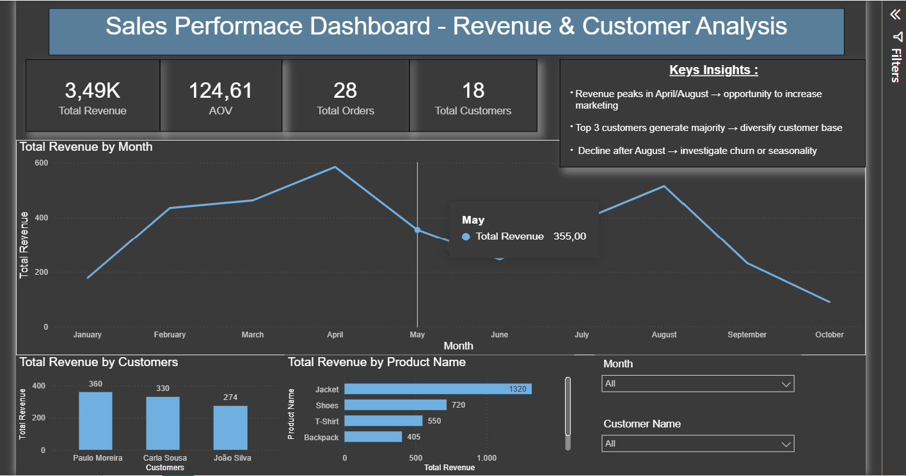

# 📊 Sales Performance Dashboard

This project analyzes sales performance using SQL and Power BI.

The goal was to understand revenue trends, customer impact, and product performance through data-driven insights.

---

## 🛠️ Tools Used
- SQL (data analysis)
- Power BI (data visualization)
- Excel (data preparation)

---

## 📈 Key Metrics
- Total Revenue
- Average Order Value (AOV)
- Total Orders
- Total Customers

---

## 🔍 Key Insights
- Revenue peaks in April and August, followed by a decline
- A small group of customers generates a large portion of total revenue
- Top 3 customers contribute significantly to overall sales
- Drop after August may indicate seasonality or reduced demand

---

## 📊 Dashboard Preview

---

## 🚀 Project Goal
To simulate a real-world business scenario and practice transforming raw data into actionable insights.

---

## 📌 Next Steps
- Add SQL queries used in the analysis
- Expand dataset for deeper insights
- Build more advanced dashboards
